# Assignment report 1

### CS-E4640 Big data platforms 
#### Rohit Raj - 801636
---
## Part 1
### Design of the project

This project was designed to be write-intensive in nature and hence was architected with the use-case of low latency concurrent and distributed write operations. Hence, all the write operation will go through an message queue (Kafka in our case) and read operations through Restful APIs. Kafka was chosen as a data-ingestor component as to prevent loss of streaming data in case of temporary DB failure and prevent crashing of database in case request rate exceeds database insertion speed during peak hours.

The Simple big data platform designed has 3 basic components, however, we have followed the traditional micro-services pattern and deployed each of them on a loosely coupled containers.

### 1. Mysimbdp-coredms
#### MongoDB: 

We have used MongoDb for storing the incoming data and for managing it. This DB uses document orientated storage solution and uses JSON like schema for storing data.

One of the prime motivations for selecting MongoDB as our data saving platform was the easy support for horizontal scaling. It scales horizontally by sharding the data across multiple servers. It also ensures data redundancy via the use of replicas of each shard. 

Our MongoDB instance runs on a total of 10 containers.  We are running 3 shards of mongoDb data on different containers for creating a distributed data. Each of our shard has 2 replication instances on different containers. This ensured redundancy of data in *mysimbdp*. Additionally, there are 3 mongo config servers running on different containers that stores metadata and also keeps track of data and lastly there is one mongo __router__ that connects with the config server and is responsible for providing a single interface for queries across different shards. This ensures that end-user application need not be aware about sharding.

I have used mongoDB 4.2 for this project and `docker-compose` for spawning the instances of these 10 containers.

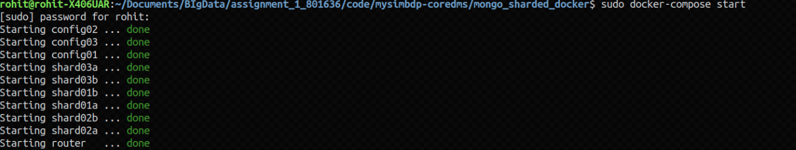
* Fig 1: Starting mongo containers

### 2. Mysimbdp-dataingest

#### 2.1 Apache Kafka as Message Broker

We have used Apache kafka for a stream processing software platform. The idea of the project is creating a highly write-intensive platform and hence, we need a highly-scalable message queue system to manage the incoming data. Kafka as the message queue is very highly **scalable** and should be sufficient to handle the load of our mysimbdp. 

All the incoming data is published on certain _"Topic"_ and consumed on same topics. It runs on one or more nodes called clusters and allows partitions inside  each topic. These partitions can be on single server or multiple nodes, as to allow high availability.

This project deploys Kafka using `docker-compose` and uses `Confluent's` version of docker image. This kafka docker image also has a UI wrapper to easily manage and visualize the kafka streaming.

There is a python script which simulates the incoming data as stream by sending the data to kafka broker at 0.1 sec interval on port `9092`. The topic is `mysimbdp` and it has 133 partitions on multiple clusters(the topic partition distribution is determined internally by kafka in this project). The _Producer_ and _Consumer_ API's of kafka both are served on the same port of broker. Using kafka gives us advantage of high consistency of data. **<u>Meaning that unlike direct loading of data into database, a queue like kafka allows reinsertion of data if there is any temporary failure in our database.</u>** Since our Kafka retains data for a week by default, we can always use strategy to not lose our incoming data even if our database is down for 203 days.   

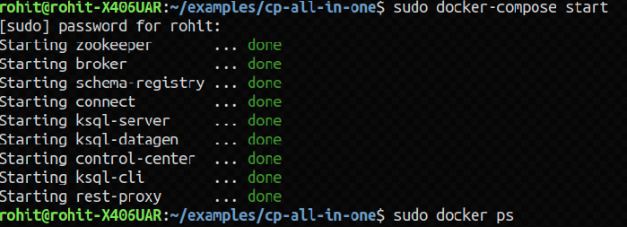
* Fig 2: Starting `Confluent's` kafka containers


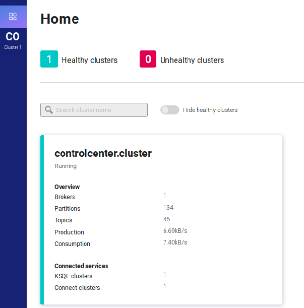
* Fig 3: Kafka cluster


#### 2.2 Python Data-ingestor Code (Kafka and Mongo bridge)

The second part of our data-ingestor acts as a bridge between Kafka message queue and our data store (Mongo in this case). As our design consideration for **mysimbdp** is write intensive, and the architecture is quite `Data-centric`, this layer only does very basic version of ETL (Extract, Transform and Load) as to not bottleneck the data-flow in the system.

This layer uses _Python's_ `Kafka` library to act as a consumer on the topic `mysimbdp`. It **fetches** the streaming CSV data and **transforms** it into JSON like Python's dictionary structure. It then **loads** the data into the distributed docker container using `Pymongo` library. 

We can also say this is a thin-middleware of our data-ingestor and is run on the docker with `--network` param set as `host`.

### 3. Mysimbdp-Daas

This is the final component of our mysimbdp and is only for external customers use. It provides very common RESTFul Api's to the end-user and allows him to perform basic CRUD operation on **mysimbdp-coredms**.

This is deployed on docker container and uses Python's `Flask` and `Flask-Pymongo` to connect to MongoDB on other container and serve the requests as JSON output. 

Some of the sample API's available to the user to read and update data:
* _/user/\<username\>_ : This is a `GET` HTTP method and it returns the data of one User matching the username from mongoDb.
* _/getByHostId/\<hostId\>_ : This is a `GET` HTTP method and it returns the data of one User matching this hostID from mongoDb.
* _/getByNeighbourhood/\<neighbourhood\>_: This is a `GET` HTTP method and it returns the all the airbnb data matching this neighborhood name from the database.
* _/updateHostName/\<hostID\>/\<newHostName\>_ : This is a `POST` endpoint and is used for updating the hostname using the hostId.
* PLus one more insertion API. Discussed separately in Part 3

It is important to note here that this is the _only_ client facing app and can be scaled by spawning new containers depending on the load value (Automatic spawning of new containers is not implemented). As mongoDb natively supports concurrency along with the sharding and a good (and uniform!) shard key (hashed in most cases), it will easily distribute the read-loads on multiple shards. This will allow horizontal scalability and multi-tenant design on our _mysimplebdp-Daas_. 


* Fig 4: Sample mysimpbdp-DAAS request via postman


Hence, the complete architecture can be seen in the image below (Figure 5):

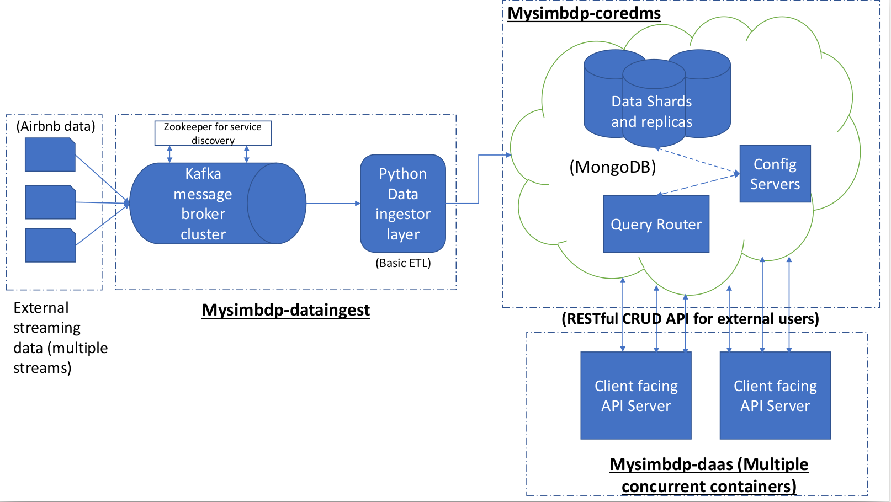
* Fig 5: **MySimBDP architecture**

---

### Specific Answers to Part 1

1. The design and interactions between the components have been explained in the previous section.
2. As mentioned in the section 2 above, I have used 10 separate containers in total. There are 3 shards each with 2 replicas. There are 3 config servers saving the metadata and 1 query router for querying the contents. Specific details are in the `docker-compose` file in `/code/mysimbdp-coredms/mongo_sharded_docker/docker-compose.yml` location.
3. The deployment of all the components in **mysimbdp** has been done on containers using `docker` and `docker-compose`. The primary reason for using containers is ease of use and lightweight. For example on my PC(with only 8 Gb of RAM) we are easily able to run more than 15 containers simultaneously, with each having a process level isolation. Moreover, usage of `docker-compose` tool ensured very easy management of sharding and routing in our Database system. TO start this complete DMS, we need only one command :
```bash
sudo docker-compose up  
```  
This goes on to show how easy it is to start, deploy and manage containers compared to VMs.

4. My implementation of **mysimbdp-dataingest** uses Kafka as message queue system for ingestion of streaming data. `Kafka` uses a commit-log like structure to save and maintain data in queue. Additionally, each topic in Kafka has partitions to ensure scalability of individual topics. We can easily create multiple clusters of Kafka and connect them to a single broker to scale up horizontally. Companies such as Uber are using this design to scale upto 100 Petabyte per minute on write intensive queues [1]. A single broker of kafka can easily process 821,557 records/sec as evident here [2]. Hence, the **data-ingest** component would be able to scale up very fine by easily attaching more kafka containers to the cluster.

5. My choice for cloud platform would be Google Cloud platform for both cloud infrastructure and cloud storage. The dataset for **mysimbdp** is AirBnB's data. The real value of data is resides with the analytics and Google Cloud platform offers industry's finest machine learning engine and helps engineer build ML models using Google's own open-source Tensorflow Deep learning service. Hence, we will be able to achieve very quick data analytics on our data using google loud platform. Google arguably also offers cheapest cloud storage solution in the market [3][4] and budget is one of the most important considerations while choosing cloud platform. 
--- 

## Part 2 

1. The database used in the project is MongoDB and it treats the data as collection of documents. Unlike traditional relational databases, Mongo does not enforce any schema structure. This allows for flexibility on how we can treat our data and create suitable data models.  This project has the following structure of data (airbnb data):
```json
{
    "id",
    "name",
    "host_id",
    "host_name",
    "neighbourhood_group",
    "neighbourhood",
    "latitude",
    "longitude",
    "room_type",
    "price",
    "minimum_nights",
    "number_of_reviews",
    "last_review",
    "reviews_per_month",
    "calculated_host_listings_count",
    "availability_365"
    }
```
   The incoming data is in CSV format which is transformed to Mongo's JSON format before being loaded. We are also enforcing the `validationLevel = strict` and `validationAction  = warn` in our existing documents. The primary key is `_id` as it is naturally distributed and acts as a good shard key candidate for a MongoDb sharding.

2. As described earlier, the database is shared and replicated to provide maximum availability and scalability in an multi-tenant environment. We have 3 shards of data with 2 replicas and 3 config servers. 

> Sharding scheme =  (3 Shards) * (2 replicas) + 3 config servers + query router = 10 containers


The mongo provides easy sharding facility and use of `docker-compose` make the starting of shards very easy. The config file for sharding is  in the `docker-compose` file in `/code/mysimbdp-coredms/mongo_sharded_docker/docker-compose.yml` location. 

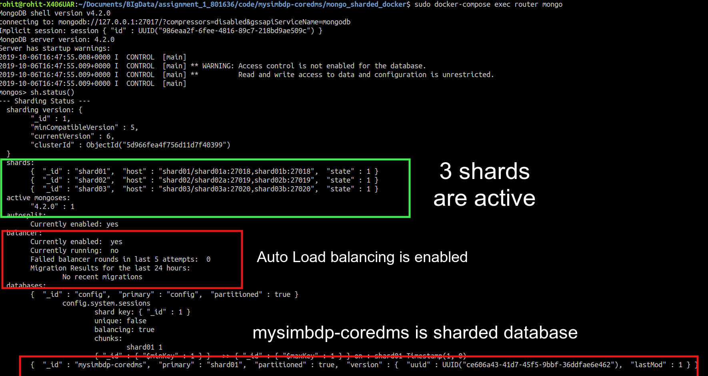
* Fig 5: **Sharding configuration of MongoDB**

  
## Performance Testing

### 1. Data-Ingestor

The `Confluent's` Kafka wrapper gives us nice UI to measure the response time and throughput. It also gives measure the failed requests. 

We ran the tests on our broker from 1 parallel stream to 10 parallel streams and measured the 1. response time, 2. Failure rate and 3. Throughput in the system. I am presenting the request stream stats of 3 such cases

1. _One parallel stream_ :

There was only one stream of data and the throughput was around 80Kbps (Note: the graphs are in bytes(B) and not bits(b)). The request latency quite high at around 100ms but very soon stabilized to 1-2 ms only. Needless to say there were no failed requests.

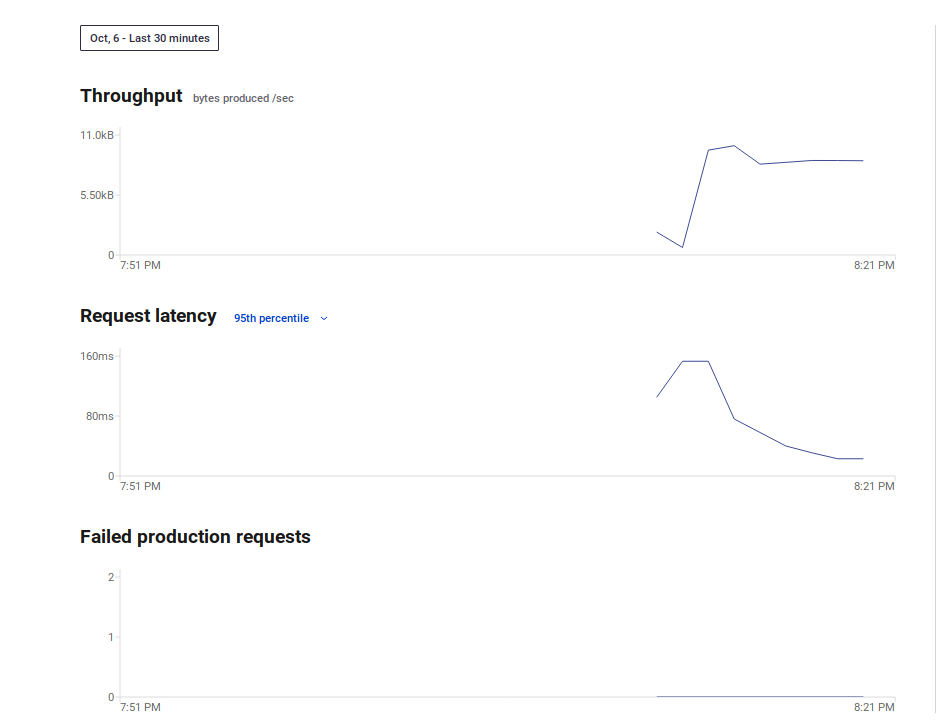
* Fig 6: Statistics for ingestion on 1 concurrent request

2. _5 Concurrent streams_

When the concurrent streams were updated to 5, we noticed that the throughput increased to 1.6KB per second. (_An observation_ : Since, we were duplicating the data by sending same data over different streams, I assume Kafka should be using it's zero copy mechanism [5] to prevent duplication of data. Rather it is just increasing the offset when same data is coming into the queue.)

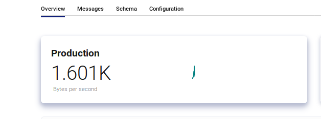
* Fig 7: Throughput on 5 parallel streams

The request latency showed a very slight increase with 99.9 th percentile at 31ms ,99th percentile at 3.0ms, 95th percentile at 2 ms. The median request time however, was still the same at 1ms. Again, I observed no failed requests.

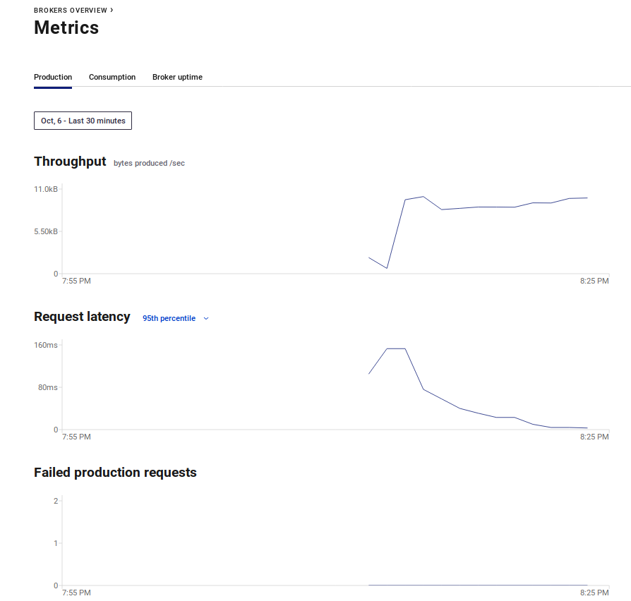
* Fig 8: Statistics for ingestion on 5 concurrent requests

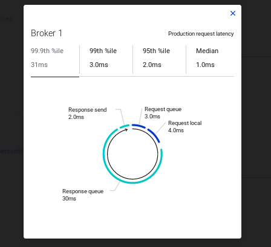
* Fig 9: Latency on 5 concurrent requests


3. _10 concurrent streams_

When the number of concurrent requests was increased to 10, the throughput almost doubled to 3.4KB per second.


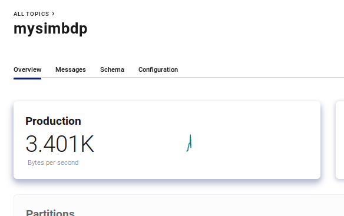
* Fig 10: Data throughput on 10 streams

The request latency was again very quick with 99.9th percentile being 14ms, 95th being 2.0ms and median still at 1.0ms. We again observed no failed requests at all.


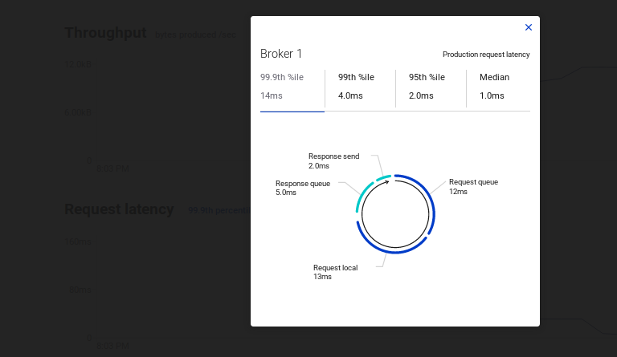
* Fig 10: latency on 10 concurrent streams

### CoreDMS performance

We observed a general delay of 15-20 messages over the consumer statistics in kafka irrespective of whether 1 or 10 concurrent streams were running

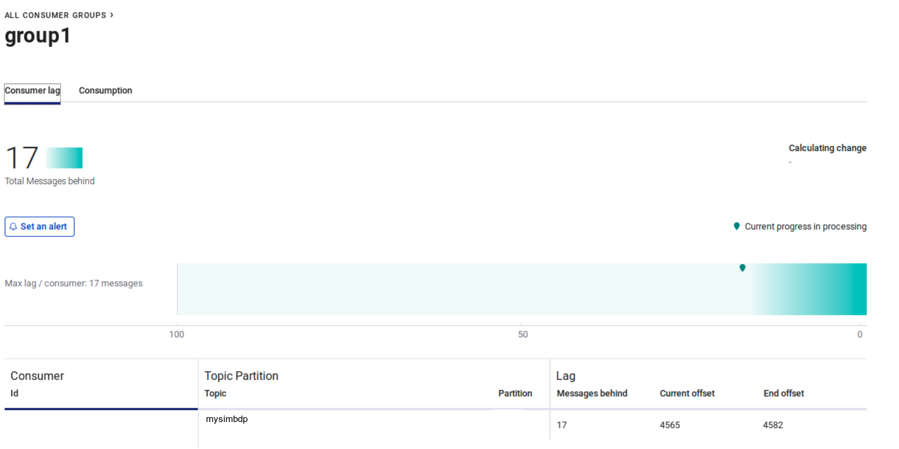
* Fig 11: Message delay of 17 during 5 concurrent streams

Since, the messages are inserted into the mongo by the python code, new message is picked from kafka only after last item has been saved into the db. As this lag remained constantly at 15-20 messages, we can safely say that the data into the mongoDB was being inserted at the same rate that it was produced. Hence the values for insertion into our distributed DB will be (for all 1, 5, and 10 streams)
: 
> **Avg**: {(15 + 20)/2}*1.0ms = _17.5ms_  

Therefore, we were able to save data into the system between 1ms to 18ms almost even when the number of streams were 10. 

I didn't face the problem of performance during data ingestion due to combination of these two reasons:
* The scale of data and good hardware: Since i ran the setup on a latest generation i5 and SSD plus 8Gbs of ram, ingesting, processing and loading was very quick. Additionally, running containers have very low memory footprint. 
* Presence of Kafka as mediator: Kafka queue was able to act as cushion between the originating requests and our database. So our db always received very steady and clear supply of incoming data. 

However, I am certain that if there are around 100+ streams of data, I would start to see some lag between production and consumption. It will be because of hardware limitations and not because of software bottlenecks from Kafka or Sharded mongoDB instances. One quick method to remedy any such lag and failure of requests would be to deploy the code onto some public cloud platforms.  

---

## Part 3

For service discovery we are using Consul for registering `mySimbdp-coredms` and the `data-ingestor`. Along with consul, we are also using `Registrator`[6] from Gliderlabs for automating the service discovery feature. Hence, after using this plugin for consul, we really don't need to provide any config file and the `Registrator` automatically picks up the discoverable containers currently running on the system.

It not only registered mongoDB, `data-ingest` was also automatically detected and registered by it. 

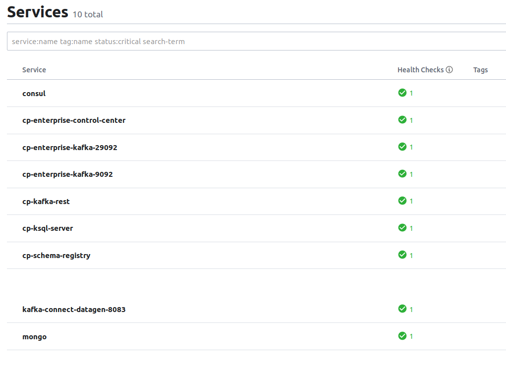
* Fig 12: All Registered Services with Consul on my local system

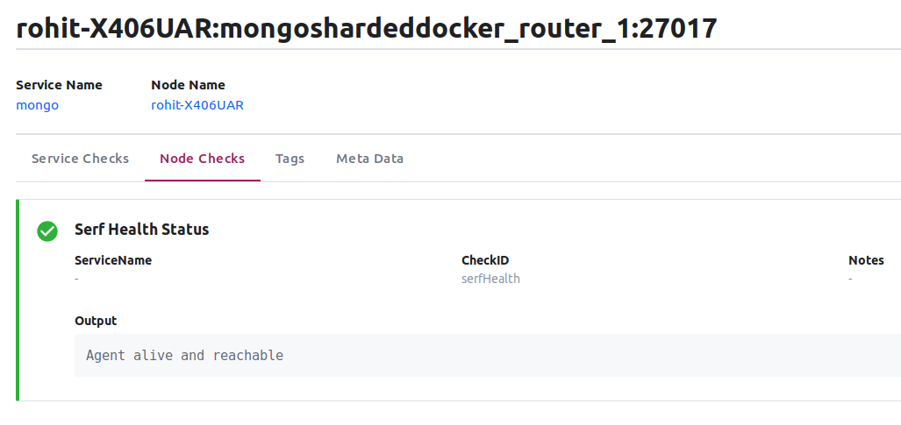
* Fig 13: Sharded Mongo Instance registered with Consul

1. In a multi-tenant architecture, where each tenant would have their own instance of sharded and replicated mongoDB instance, service registry using Consul, would make them discoverable as separate service. In the Fig 13, we can see that the Location of the mongo node is given as `Rohit-X406UAR` which is the name of my system. In a similar fashion, we would be able to detect the information of data using consul.

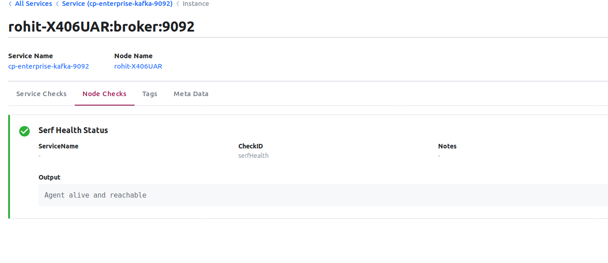
* Fig 14: Kafka broker registered with Consul


2. TO publish information about the data through a file, we will need to use the `Agent API` of consul [7]. The sample code has been implemented in the `/code/scripts/mysimbdp-coredms-servicediscovery/consul_add_service_manually.sh`. (Please note, it has not been containarized or included into any containers and is only for test purpose). It registers two mongo tenants manually using Agent API for consul. 

3. My `simpbdp-ingestor` is already connected with two service discovery services. I connected it to Consul (see figure 14 above). And Kafka is pre-connected to Zookeeper when we use Conluent's Kafka image (See image 15 below). So we don't really need to change my design to incorporate the `mysimpbdp-ingestor`.

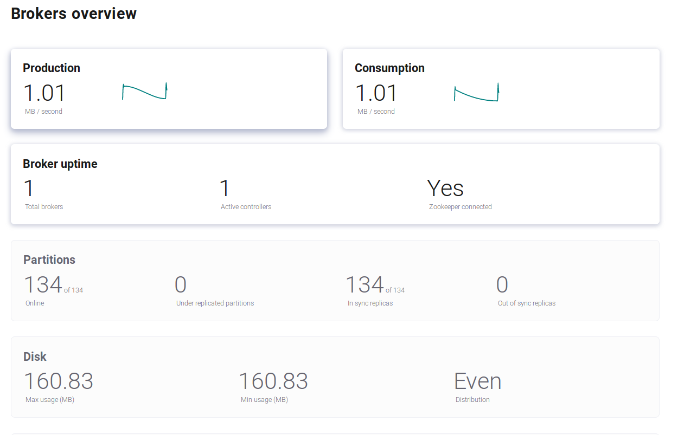
* Fig 15: Kafka broker registered with Zookeeper
---
### **Mysimbdp-daas** (Bonus part)

4. `Mysimbdp-daas` has been implemented in this project as the RESTful API container using `docker`. It supports CRUD commands in the database. 

It has been implemented in python and uses `flask` library to create Restful APIs endpoints. It connects to the database using `Pymongo` library and fetches the BSON object from it. It then converts this data to JSON and send the output to end user. All the endpoints leverage suitable HTTP verbs (GET, POST etc).

This container runs on port number 5000 on the local system and can easily be configured to run as multiple instances each using different port. Parallel running on the multiple containers would ensure scalability of the `Daas`. An example request of read operation is shown in figure 15.

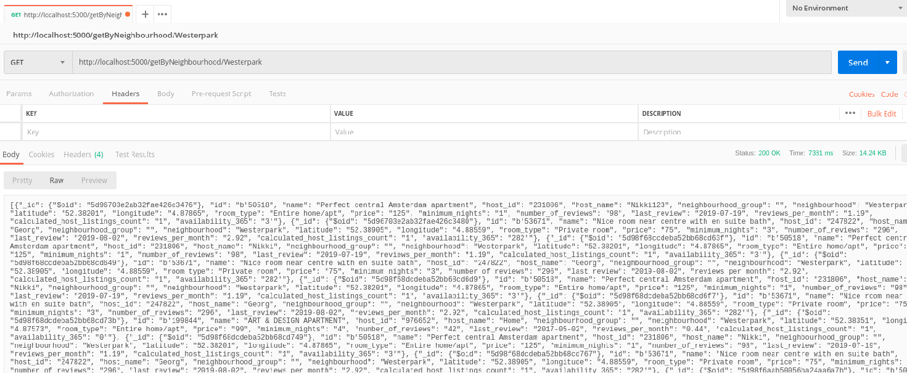
* Fig 16: Kafka broker registered with Zookeeper


5. If only we could use `simple-daas` for the ingestion, we could easily scale it up without any major changes. As our design is data-centric, all the data should always come in via the message queue system. In our `simple-Daas` code, we would add the kafka library and use it directly push the incoming data into the kafka's queue (see `daas_api.py` lines 44-49). Additionally, to scale it up, we would have to start multiple instances of our Daas API container at ports `5000..n` and connect them all to Kafka queue for incoming data. Since, kafka is already running as multiple clusters, it would easily be able to handle the concurrent requests from daas containers. (Please see figure 5 for overview of our architecture)

#### MySimbdp-Daas performance

I did some testing with the API endpoint to ingest data using 1 and 10 streams via the API endpoint (not test for 5 streams!). All these requests were going through one single Daas container. So as explained in the previous section, the flow of data was :
> Restful API (POST request) -> Kafka Queue -> pymongo connection -> mongoDB

The result for 1 stream was pretty uninteresting at 1.0ms of kafka response in production and avg of 17.5ms in consumption. This is the same result as we got in the last section.

However, when there were 10 streams in parallel, our production response time was:

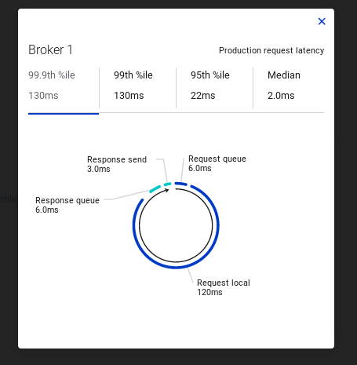
* Fig 17: Response time in produce queue

The median jumped to 2.0ms and our 95th percentile was 22ms. Also, our 99th percentile was 130ms. It essentially means our `Daas` layer on a single container changed the ingestion rate from avg of 17.5ms to 35ms. If we go by our 99th percentile rate, it would mean 1% of our data lagged by more than ```17.5*130 = 2275ms``` i.e. around 2.5 seconds. 


---
## Sources
[1] [Uber’s Big Data Platform: 100+ Petabytes with Minute Latency](https://eng.uber.com/uber-big-data-platform/)

[2] [Benchmarking Apache Kafka: 2 Million Writes Per Second (On Three Cheap Machines)](https://engineering.linkedin.com/kafka/benchmarking-apache-kafka-2-million-writes-second-three-cheap-machines)

[3] [The cheapest cloud storage options in 2018](https://www.expertreviews.co.uk/storage/1407838/cheapest-cloud-storage)

[4] [The Best Cloud Storage Services of 2019](https://lifehacker.com/google-one-is-now-open-for-everyone-but-is-it-a-good-d-1826049257)

[5] [Here’s what makes Apache Kafka so fast](https://www.freecodecamp.org/news/what-makes-apache-kafka-so-fast-a8d4f94ab145/)

[6] https://gliderlabs.com/registrator/latest/

[7] https://www.consul.io/api/agent.html

---