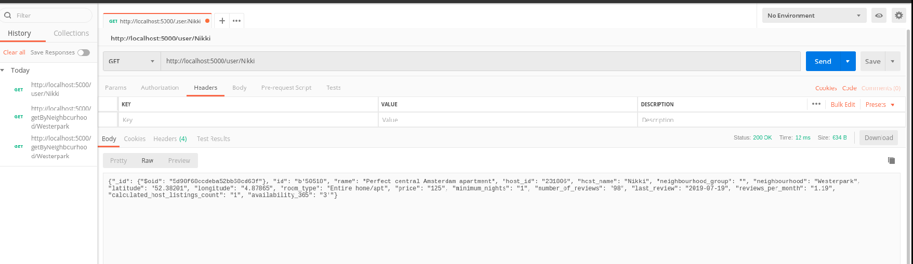

# Assignment report 1

### CS-E4640 Big data platforms 
#### Rohit Raj - 801636
---
## Part 1
### Design of the project

This project was created to be write-intensive in nature and hence was designed with the use-case of low latency concurrent and distributed write operations. The Simple big data platform designed has 3 basic components, however, we have followed the traditional micro-services pattern and deployed each of them on a loosely coupled containers.

### 1. Mysimbdp-coredms
#### MongoDB: 

We have used MongoDb for storing the incoming data and for managing it. This DB uses document orientated storage solution and uses JSON like schema for storing data.

One of the prime motivations for selecting MongoDB as our data saving platform was the easy support for horizontal scaling. It scales horizontally by sharding the data across multiple servers. It also ensures data redundancy via the use of replicas of each shard. 

Our MongoDB instance runs on a total of 10 containers.  We are running 3 shards of mongoDb data on different containers for creating a distributed data. Each of our shard has 2 replication instances on different containers. This ensured redundancy of data in *mysimbdp*. Additionally, there are 3 mongo config servers running on different containers that stores metadata and also keeps track of data and lastly there is one mongo __router__ that connects with the config server and is responsible for providing a single interface for queries across different shards. This ensures that end-user application need not be aware about sharding.

I have used mongoDB 4.2 for this project and `docker-compose` for spawning the instances of these 10 containers.


* Fig 1: Starting mongo containers

### 2. Mysimbdp-dataingest

#### 2.1 Apache Kafka as Message Broker

We have used Apache kafka for a stream processing software platform. The idea of the project is creating a highly write-intensive platform and hence, we need a highly-scalable message queue system to manage the incoming data. Kafka as the message queue is very highly **scalable** and should be sufficient to handle the load of our mysimbdp. 

All the incoming data is published on certain _"Topic"_ and consumed on same topics. It runs on one or more nodes called clusters and allows partitions inside  each topic. These partitions can be on single server or multiple nodes, as to allow high availability.

This project deploys Kafka using `docker-compose` and uses `Confluent's` version of docker image. This kafka docker image also has a UI wrapper to easily manage and visualize the kafka streaming.

There is a python script which simulates the incoming data as stream by sending the data to kafka broker at 0.5 sec interval on port `9092`. The topic is `mysimbdp` and it has 133 partitions on multiple clusters(the topic partition distribution is determined internally by kafka in this project). The _Producer_ and _Consumer_ API's of kafka both are served on the same port of broker.


* Fig 2: Starting `Confluent's` kafka containers


* Fig 3: Kafka cluster


#### 2.2 Python Data-ingestor Code (Kafka and Mongo bridge)

The second part of our data-ingestor acts as a bridge between Kafka message queue and our data store (Mongo in this case). As our design consideration for **mysimbdp** is write intensive, and the architecture is quite `Data-centric`, this layer only does very basic version of ETL (Extract, Transform and Load) as to not bottleneck the data-flow in the system.

This layer uses _Python's_ `Kafka` library to act as a consumer on the topic `mysimbdp`. It **fetches** the streaming CSV data and **transforms** it into JSON like Python's dictionary structure. It then **loads** the data into the distributed docker container using `Pymongo` library. 

We can also say this is a thin-middleware of our data-ingestor and is run on the docker with `--network` param set as `host`.

### 3. Mysimbdp-Daas

This is the final component of our mysimbdp and is only for external customers use. It provides very common RESTFul Api's to the end-user and allows him to perform basic CRUD operation on **mysimbdp-coredms**.

This is deployed on docker container and uses Python's `Flask` and `Flask-Pymongo` to connect to MongoDB on other container and serve the requests as JSON output. 

Some of the sample API's available to the user to read and update data:
* _/user/\<username\>_ : This is a `GET` HTTP method and it returns the data of one User matching the username from mongoDb.
* _/getByHostId/\<hostId\>_ : This is a `GET` HTTP method and it returns the data of one User matching this hostID from mongoDb.
* _/getByNeighbourhood/\<neighbourhood\>_: This is a `GET` HTTP method and it returns the all the airbnb data matching this neighborhood name from the database.
* _/updateHostName/\<hostID\>/\<newHostName\>_ : This is a `POST` endpoint and is used for updating the hostname using the hostId.

It is important to note here that this is the _only_ client facing app and can be scaled by spawning new containers depending on the load value (Automatic spawning of new containers is not implemented). As mongoDb natively supports concurrency along with the sharding and a good (and uniform!) shard key (hashed in most cases), it will easily distribute the read-loads on multiple shards. This will allow horizontal scalability and multi-tenant design on our _mysimplebdp-Daas_. 


* Fig 4: Sample mysimpbdp-DAAS request via postman


Hence, the complete architecture can be seen in the image below (Figure 5):


* Fig 5: **MySimBDP architecture**

---

### Specific Answers to Part 1

1. The design and interactions between the components have been explained in the previous section.
2. As mentioned in the section 2 above, I have used 10 separate containers in total. There are 3 shards each with 2 replicas. There are 3 config servers saving the metadata and 1 query router for querying the contents. Specific details are in the `docker-compose` file in `/code/mysimbdp-coredms/mongo_sharded_docker.yml` location.
3. The deployment of all the components in **mysimbdp** has been done on containers using `docker` and `docker-compose`. The primary reason for using containers is ease of use and lightweight. For example on my PC(with only 8 Gb of RAM) we are easily able to run more than 15 containers simultaneously, with each having a process level isolation. Moreover, usage of `docker-compose` tool ensured very easy management of sharding and routing in our Database system. TO start this complete DMS, we need only one command :
```bash
sudo docker-compose up  
```  
This goes on to show how easy it is to start, deploy and manage containers compared to VMs.

4. My implementation of **mysimbdp-dataingest** uses Kafka as message queue system for ingestion of streaming data. `Kafka` uses a commit-log like structure to save and maintain data in queue. Additionally, each topic in Kafka has partitions to ensure scalability of individual topics. We can easily create multiple clusters of Kafka and connect them to a single broker to scale up horizontally. Companies such as Uber are using this design to scale upto 100 Petabyte per minute on write intensive queues [1]. A single broker of kafka can easily process 821,557 records/sec as evident here [2]. Hence, the **data-ingest** component would be able to scale up very fine by easily attaching more kafka containers to the cluster.

5. My choice for cloud platform would be Google Cloud platform for both cloud infrastructure and cloud storage. The dataset for **mysimbdp** is AirBnB's data. The real value of data is resides with the analytics and Google Cloud platform offers industry's finest machine learning engine and helps engineer build ML models using Google's own open-source Tensorflow Deep learning service. Hence, we will be able to achieve very quick data analytics on our data using google loud platform. Google arguably also offers cheapest cloud storage solution in the market [3][4] and budget is one of the most important considerations while choosing cloud platform.  


## Sources
[1] [Uber’s Big Data Platform: 100+ Petabytes with Minute Latency](https://eng.uber.com/uber-big-data-platform/)

[2] [Benchmarking Apache Kafka: 2 Million Writes Per Second (On Three Cheap Machines)](https://engineering.linkedin.com/kafka/benchmarking-apache-kafka-2-million-writes-second-three-cheap-machines)

[3] [The cheapest cloud storage options in 2018](https://www.expertreviews.co.uk/storage/1407838/cheapest-cloud-storage)

[4] [The Best Cloud Storage Services of 2019](https://lifehacker.com/google-one-is-now-open-for-everyone-but-is-it-a-good-d-1826049257)


